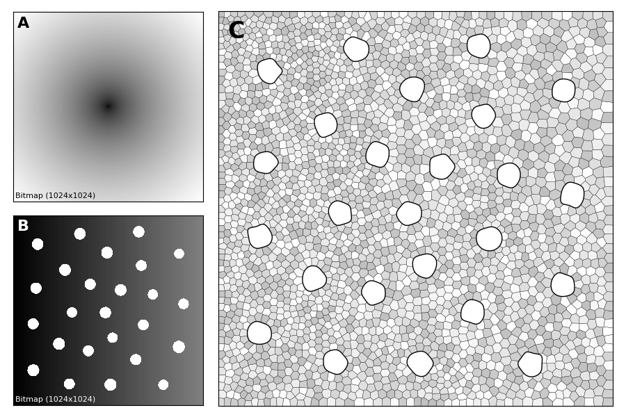

**A density-driven method for the placement of biological cells over two-dimensional manifolds**  
Copyright 2017 Nicolas P. Rougier, BSD License.



### Figure 1

Please go to https://github.com/ReScience-Archives/Rougier-2017

### Figure 2

Run the script [figure-2.py](./figure-2.py).

### Figure 4

Before running [figure-4.py](./figure-4.py), you'll need to run the
[stippler.py](stippler.py) script on the
[gradient-1024x256.png](data/gradient-1024x256.png) image as follows:

```
$ ./stippler.py --n_iter 25 --n_point 1000 --channel red data/gradient-1024x256.png
$ mv data/gradient-1024x256-stipple-1000.npy output
$
$ ./stippler.py --n_iter 25 --n_point 2500 --channel red data/gradient-1024x256.png
$ mv data/gradient-1024x256-stipple-2500.npy output
$
$ ./stippler.py --n_iter 25 --n_point 5000 --channel red data/gradient-1024x256.png
$ mv data/gradient-1024x256-stipple-5000.npy output
$
$ ./stippler.py --n_iter 25 --n_point 10000 --channel red data/gradient-1024x256.png
$ mv data/gradient-1024x256-stipple-10000.npy output
```

### Figure 5

Run the script [figure-5.py](./figure-5.py).

### Figure 6

Run scripts [figure-6A.py](./figure-6A.py), [figure-6B.py](./figure-6B.py) and [figure-6C.py](./figure-6C.py).

### Figure 7

Run the script [figure-7AC.py](./figure-7AC.py), then run:

```
$ ./stippler.py --n_iter 25 --n_point 25000 --channel red output/galago-patch.png
$ ./stippler.py --n_iter 25 --n_point 25000 --channel red output/galago-inter.png
```

Then run the script [figure-7BD.py](./figure-7BD.py).
