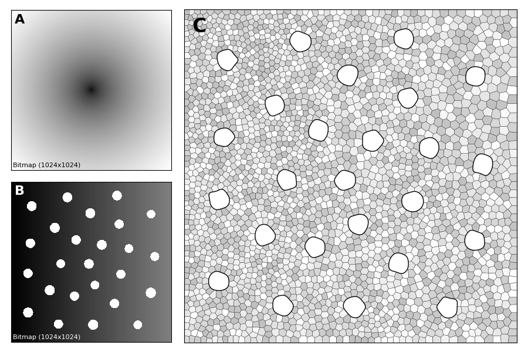

**A density-driven method for the placement of biological cells over two-dimensional manifolds**  
Copyright 2017 Nicolas P. Rougier, BSD License.

We introduce a graphical method originating from the computer graphics domain
that is used for the arbitrary placement of cells over a two-dimensional
manifold. Using a bitmap image whose luminance provides cell density, this
method guarantees a discrete distribution of cell position re- specting the
local density.  is method scales to any number of cells, allows to specify
arbitrary shapes and provides a scalable and versatile alternative to the more
classical assumption of a non- uniform spatial distribution.  e method is
illustrated on a discrete homogeneous neural eld, on the distribution of cones
and rods in the retina and on the neural density on a a ened piece of cortex.




### Figure 1

Please go to https://github.com/ReScience-Archives/Rougier-2017

### Figure 2

Before running [figure-2.py](./figure-2.py), you'll need to run the
[stippler.py](stippler.py) script on the
[gradient-1024x256.png](data/gradient-1024x256.png) image as follows:

```
$ ./stippler.py --n_iter 25 --n_point 1000 --channel red data/gradient-1024x256.png
$ mv data/gradient-1024x256-stipple-1000.npy output
$
$ ./stippler.py --n_iter 25 --n_point 2500 --channel red data/gradient-1024x256.png
$ mv data/gradient-1024x256-stipple-2500.npy output
$
$ ./stippler.py --n_iter 25 --n_point 5000 --channel red data/gradient-1024x256.png
$ mv data/gradient-1024x256-stipple-5000.npy output
$
$ ./stippler.py --n_iter 25 --n_point 10000 --channel red data/gradient-1024x256.png
$ mv data/gradient-1024x256-stipple-10000.npy output
```

### Figure 3

Run the script [figure-3.py](./figure-3.py).

### Figure 5

Run the script [figure-5.py](./figure-5.py).


### Figure 6

Run the script [figure-6.py](./figure-6.py).


### Figure 7

Run the script [figure-7.py](./figure-7.py).

### Figure 8

Run scripts [figure-8A.py](./figure-8A.py), [figure-8B.py](./figure-8B.py) and [figure-8C.py](./figure-8C.py).


### Figure 9

Run the script [figure-9AC.py](./figure-9AC.py), then run:

```
$ ./stippler.py --n_iter 25 --n_point 25000 --channel red output/galago-patch.png
$ ./stippler.py --n_iter 25 --n_point 25000 --channel red output/galago-inter.png
```

Then run the script [figure-9BD.py](./figure-9BD.py).

